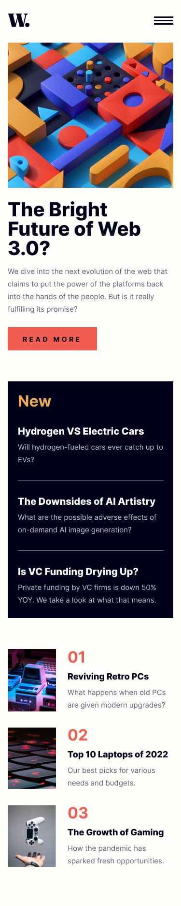

# Frontend Mentor - News Homepage Solution 🗞️

This is a solution to the [News homepage challenge on Frontend Mentor](https://www.frontendmentor.io/challenges/news-homepage-H6SWTa1MFl). Frontend Mentor challenges help you improve your coding skills by building realistic projects.

## Table of Contents 📑

- [Overview](#overview)
  - [The Challenge](#the-challenge)
  - [Screenshot](#screenshot)
  - [Links](#links)
- [My Process](#my-process)
  - [Built With](#built-with)
  - [What I Learned](#what-i-learned)
  - [Continued Development](#continued-development)
  - [Useful Resources](#useful-resources)
- [Author](#author)
- [Acknowledgments](#acknowledgments)

## Overview 🔎

### The Challenge

Users should be able to:

- View the optimal layout for the interface depending on their device's screen size 📱💻
- See hover and focus states for all interactive elements on the page 🖱️

### Screenshot

#### Desktop Preview


#### Desktop active-states preview


#### Mobile Preview


#### Mobile menu


### Links

- Solution URL: [Frontend Mentor](https://your-solution-url.com)
- Live Site URL: [News Homepage](https://news-homepage-sigma-six.vercel.app/)

## My Process 🛠️

### Built With

- Semantic HTML5 markup
- CSS custom properties
- Flexbox
- CSS Grid
- Mobile-first workflow
- JavaScript for interactive features

### What I Learned

During this project, I deepened my understanding of:

- Responsive design principles 📐
- CSS Grid for complex layouts 🏗️
- JavaScript DOM manipulation for the mobile menu 📱

```css
.proud-of-this-css {
  display: grid;
  grid-template-columns: repeat(auto-fit, minmax(250px, 1fr));
}
```

```js
const toggleMenu = () => {
  // Mobile menu toggle logic
}
```

### Continued Development

Moving forward, I plan to focus on:

- Enhancing accessibility features 🌐
- Optimizing performance for faster load times ⚡
- Exploring CSS animations for subtle UI enhancements ✨

### Useful Resources

- [CSS-Tricks Guide to Flexbox](https://css-tricks.com/snippets/css/a-guide-to-flexbox/) - An invaluable resource for mastering Flexbox layouts.
- [MDN Web Docs](https://developer.mozilla.org/) - Comprehensive web development documentation.

## Author 👨‍💻

- Website - [Abdullah](https://social-links-profile-rose-mu.vercel.app/)
- LinkedIn - [LinkedIn](https://www.linkedin.com/in/abdullah-a-2940b7260/)
- Frontend Mentor - [Abdullah](https://www.frontendmentor.io/profile/Ayyubiy90)
- Twitter - [Abdullah](https://www.twitter.com/ayyubiy10)
- Instagram - [Abdullah](https://www.instagram.com/ayyubiy_10)

## Acknowledgments 🙏

A special thank you to Frontend Mentor for providing this challenge. I also appreciate the community for their inspiration and support!